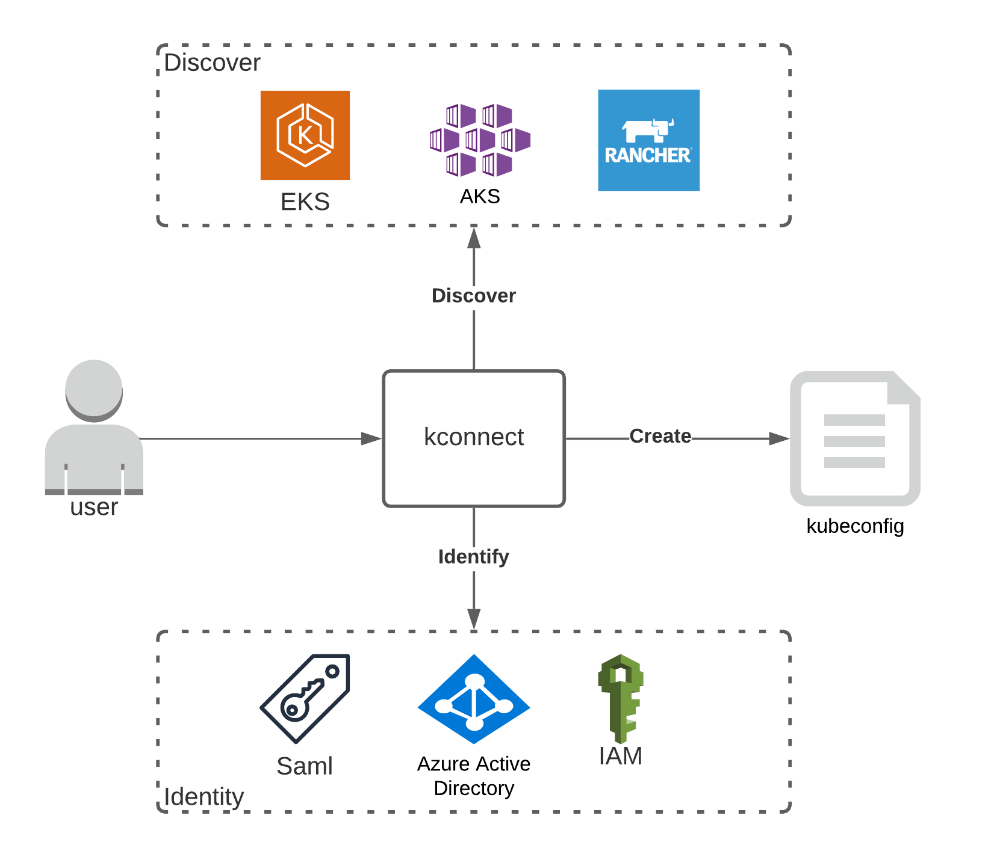
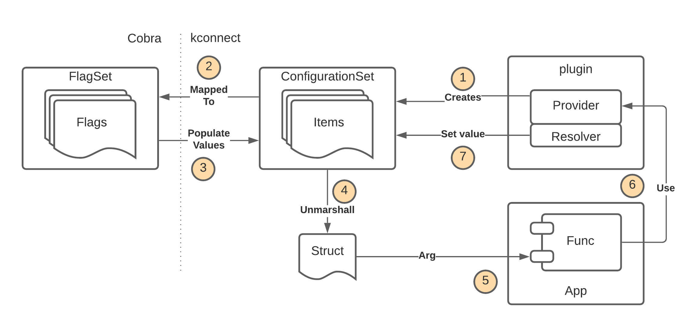

# Architecture

This describes the high-level architecture of kconnect. If you are a new contributor or just want to understand the code base this is the place for you.

## High level

kconnect is a cli utility that can be used to discover what Kubernetes clusters you have access to and then generate the kubeconfig for you to connect to a given clusters. It can be used to discover EKS, AKS and Rancher based clusters.

At its core is the concept of a **provider** which represents a discrete piece of logic and this serves as the future extensions point. There are 2 types of providers:

* **Identity** - used to implement authentication mechanism/protocol that will identity the user. For example, there is the SAML and Azure Active Directory identity provider that will.
* **Discovery** - used to discover what clusters a given identity has access to and to generate a kubeconfig for a specific cluster.



There are `plugins` that implement a provider for specific identity mechanism (i.e. SAML) or Kubernetes hosting environment. So a provider is used via a plugin. When we talked about `plugins` this is a code pattern and not a separate binary.

## Code Map

In this section we cover various important packages and data structures. This document deliberately doesn't have direct links to the folders as these may change over time.

## `pkg/config`

This holds the definitions for a config item (**Item**) and a set of config items (**ConfigurationSet**). This package is core to how providers declare their configuration options that they expose. At runtime a configuration set is translated to a cobra flagset (see `pkg/flags`).

The package also contains the code that can unmarshal a **ConfigurationSet** to a struct. This is used heavily to populate the input argument to functions on the `app`.



This package is also used to query the global kconnect configuration. For instance this configuration file can be used to supply defaults so that flags don't need to be supplied.  The purpose of this is to have a company wide file full of default values that users can import in using:

```bash
kconnect config -f http://companydefaults
```


## `pkg/flags`

TODO
https://github.com/fidelity/kconnect/discussions/155 (also add as comment in code)

### `pkg/provider`

This holds the definition (i.e. interfaces & structs) for the `plugin` and plugin registration. There are a number of sub-packages that are important:

* **identity** - contains the interface definition for a `identity provider` and generic identity implementations (i.e. token)
* **discovery** - contains the interface definition for a `discovery provider` and related types. providers. I
* **registry** - implements a registry that contains a list of all the registered providers (identity & discover). Instances of providers can be returned from the registry.
* **config** - contains definitions for configuration `resolvers`. The purpose of a resolver is to get the value for a configuration item if a value hasn't already been set. The implementation of resolvers sit within the providers as the resolution logic can very specific to the hosting environment.

TODO: talk about the method signature pattern

### `pkg/plugins`

TODO
Plugin registration mechanism (i.e. init and imports), same as kubectl

### `pkg/history`

TODO

### `api/`

TODO

### `pkg/app`

TODO
make sure we talk about using as a package

### `internal/commands`

TODO


## Cross-Cutting Concerns

### Code Generation

TODO

### Error Handling

TODO

### Logging

TODO

### Testing

TODO

## Build & Release

### Go releaser

TODO

### GitHub Actions

TODO

### Krew

TODO

### Docs

TODO


