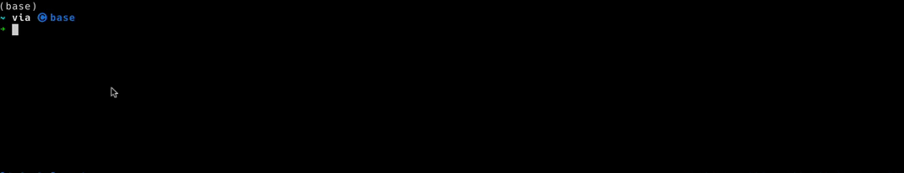

# `kconnect` - The Kubernetes Connection Manager CLI

## What is kconnect?

kconnect is a CLI utility that can be used to discover and securely access Kubernetes clusters across multiple operating environments.

Based on the authentication mechanism chosen the CLI will discover Kubernetes clusters you are allowed to access in a target hosting environment (i.e. EKS, AKS, Rancher) and generate a kubeconfig for a chosen cluster.

**Currently supported platforms: EKS, AKS, Rancher**

## Features

- Authenticate using SAML, Azure Active Directory, AWS IAM, Rancher Token
- Discover clusters in EKS, AKS and Rancher
- Generate a kubeconfig for a cluster
- Query history of connected servers
- Regenerate the kubeconfig from your history by using an id or an alias
- Import defaults values for your company

## Documentation

For installation, getting started and other documentation head over to the [projects documentation site](https://fidelity.github.io/kconnect/) or look in the [/docs](/docs) directory.

## Contributions

Contributions are very welcome. Please read the [contributing guide](CONTRIBUTING.md) or see the docs.

## Acknowledgements

For the SAML identity provider we rely heavily on the [saml2aws](https://github.com/Versent/saml2aws) project by Versent. For the Azure AD provider we have taken inspiration from the [Microsoft Authentication Library for Go](https://github.com/AzureAD/microsoft-authentication-library-for-go) and have directly used their wstrust package (see [pkg/azure/wstrust](pkg/azure/wstruct)).

Thanks to both these projects for making the implementation easier.
