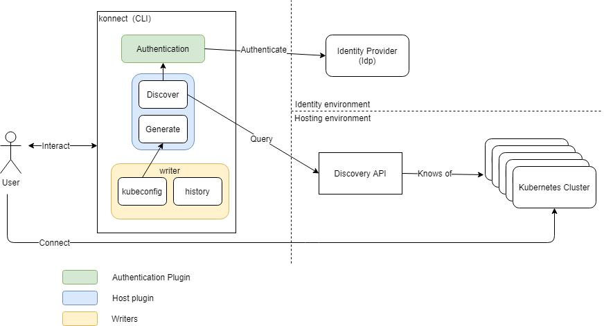
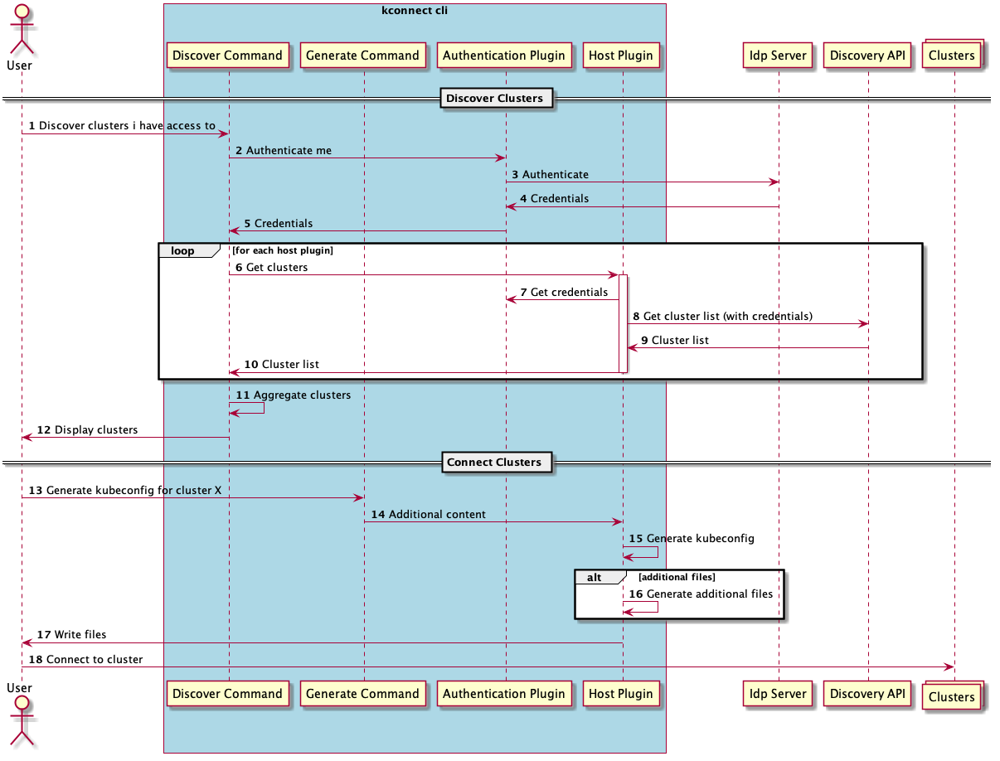

# kconnect - The Kubernetes Connection Manager CLI

## Summary

Provide a CLI utility that can be used to discover and securely access Kubernetes clusters. Based on the authentication mechanism chosen the utility will discover Kubernetes clusters you are allowed to access in a target hosting environment (i.e. EKS, AKS, Rancher) and generate a kubeconfig for a chosen cluster.

## Motivation

There doesn't exist a good open source solution that based on your user credentials (i.e. SAML, OAuth2/OIDC, IAM) will discover what Kuberneres clusters you have access to and how to get get the kubeconfig file for a cluster you have access to.

For companies who have adopted Kubernetes as part a wider Cloud Native strategy and who operate a large fleet of clusters it is difficult for users to discover what cluster they have access to and how to access them. The problem of discovering what clusters you have access to is compounded for companies that have adopted multi-cloud or hybrid-cloud.

Companies adopt a variety of mechanisms such as sharing kubeconfig (perhaps via keybase or git), listing clusters on a wiki but these solutions are very rarely coherent or user friendly. And depending on the mechanism employed they could represent a significant security risk.

We propose the creation of an open source CLI that can be used to discover what clusters you have access to across multiple hosting providers based on your credentials and for it to then generate a kubeconfig for you that can be used to access the cluster.  Additionally the CLI should keep a history of the clusters you have generated a kubeconfig so that you can choose to regenerate the kubeconfig by choosing choosing a item from your history.

### Goals

* Create a CLI in the spirit of  and similar UX of kubectl\helm\istioctl\clusterctl
* Usable interactively from a command line or via automation (i.e. CI/CD pipeline)
* Initially support authentication via SAML, OAuth2/OIDC
* Initially discover clusters in AKS, EKS, Rancher and external end-point (i.e. API based)
* Generate kubeconfig files to a file and stdout based on cluster select (discovered and from history)
* Save a history of clusters for which a kubeconfig has been generated (with a short unique identifier generated)
* Provide extensions points (i.e. interfaces) for future authentication and discovery mechanisms to be added
* Notify the user if a new version of CLI  is available
* Ability to supply values via command line, environment variables and file
* Ability to configure and save default values
* Available for download via popular package managers for Linux, Mac OSX and Windows.
* Functionality should be consumable as a library (i.e. Go package)
* Project to be run and maintained as an * OSS project on GitHub

### Non-goals/Future Work

* To generate other Kubernetes files like Helm v2 files.
* Implement discovery via Anthos, Tanzu, Cluster API.
* Implement a terminal gui

## Proposal/Design

The CLI will be developed using Go and will follow the UX conventions used by other Kubernetes based CLI utilities such as kubectl and istioctl. It will implements a number of commands that will be used to perform an action. The CLI will define a number of interfaces that will provide the contract to extend the functionality. Initially there will be 2 interfaces:

* Authentication - this will allow different authentication methods to be implemented. Initially its envisioned that plugins will be developed for SAML, OAuth2/OIDC and AWS IAM.
* Host - this will allow different Kubernetes hosting environments to be supported. Initially its envisioned that plugins will be developed for AKS, EKS, Rancher and "external".

There are 2 logical parts to a "host" plugin:

* Discover - this will use the users credentials to discover clusters. For example, this might be using the AWS SDK to query for EKS clusters.
* Generate - this will be used when the kubeconfig file is generated. It will also be the place where any additional files will be written (e.g. AWS config file)



The sequence diagram for connecting to a cluster using kconnect is:


[Original source](./artefacts/sequence.plantuml)

### User Stories

#### Story 1

As an engineer or operator, i want to discover what clusters i have access to across all host environments using my credentials, so that i can connect to a cluster.

#### Story 2

As an engineer or operator, i want to have a kubeconfig for a cluster, so that i can connect to a cluster and interact with the API Server

#### Story 3

As an engineer or operator, i want to have a history of the clusters i have generated a kubeconfig for previously, so that i can easily generate a kubeconfig again in the future

#### Story 4

As a CI/CD pipeline developer, i want to generate a kubeconfig on the fly as part of the pipeline, so that i can interact with a Kubernetes cluster as part of the pipeline

#### Story 5

As an engineer or operator, i want to be informed that a new version of the cli is available, so that i can take advantage of new features and bug fixes

#### Story 6

As an engineer or operator, i want to install the cli and its dependencies via a package manager, so that i can easily use the CLI

#### Story 7

As an engineer or operator, i want to setup local defaults based on a central defaults file for my company, so that i can have the same base defaults as the rest of the engineers

### Implementation Details/Notes/Constraints

The solution will be developed using Go and will make use of the **spf13/cobra** and **spf13/viper** packages to provide the command and argument parsing functionality.

#### Commands

##### discover

Will provide a list of clusters that you have access to. It will ask each of the "host" plugins for a list of clusters that the user has access to. The host plugin can then discover the cluster however they choose (normally by calling a API) and return the list. The user will then be presented with a aggregated list of clusters they have access to.

Each cluster will need to a stable unique identifier and its the responsibility of each host plugin to ensure it constructs a unique identifer for that platform/host.

```bash
kconnect discover -u domain\joe -p pass12345 -o json
connect
```

##### generate

Given a cluster identifier or a history id this command will create the kubeconfig file and any additional files if required (e.g. AWS .config file) so that you can connect to the cluster. We could also support supplying name and host plugin name.

There should be the option to output the kubeconfig file to a file or stdout.

```bash
kconnect generate -u domain\joe -p pass1234 -c eks_12345_cluster1 -f ~/cluster1.kubeconfig
```

##### history

Will display a list of the clusters you have previously generated kubeconfigs for. The format of the output will depend on the output format chosen (yaml is the default). No sensitive information (i.e. passwords) are included the output. Each item in the history will have a unique id (as well as the unique cluster id) so that you can use that id in generate by just supplying the history id and your password. The history will be stored in a file at $HOME/.kconnect/history

```bash
kconnect history -o table
```

##### configure

Will allow you to set default values that will be used by the other commands if no value is supplied. It will also support populating the local defaults from a file that is local or remote.

The default values will be stored in a file at $HOME/.kconnect/config

```bash
kconnect configure -u domain\joe -r northeurope -p aks
```

##### help

Will display help information.

```bash
kconnect configure help
```

##### version

Will display version, build and platform information

#### CLI Mockup

Below is pseudo command line to demonstrate how the UX will be with the kconnect CLI:

```bash
~$ kconnect configure -f https://config.corp.com/corp_defaults.yaml
INFO[000]  Setting defaults from remote             url=https://config.corp.com/corp_defaults.yaml
DEBUG[000] Set saml endpoint                        endpoint=http://ping.com
INFO[000]  Saved defaults                           file=/users/joe/.kconnect/config


~$ kconnect discover -u domain\joe -p pass12345
[
	{
		"provider": "AWS",
		"cluster_id": "cluster12345",
		"properties": [
			"account": "12345678",
			"region: "eu-west-1"
		]
	},
	{
		"provider": "Azure",
		"cluster_id": "cluster9876",
		"properties: [
			"subscription_id": "1234567",
			"region": "northeurope"
		}
	}	
]


~$ kconnect generate -u domain\joe -p pass12345 -c cluster12345 -p AWS -f ~/staging.kubeconfig
INFO[000] Checking access to cluster	cluster=cluster12345,provider=AWS 
INFO[000] Kubeconfig written to file	file=~/staging.kubeconfig,cluster=cluster12345,provider=AWS


~$ export KUBECONFIG=~/staging.kubeconfig


~$ kubectl get nodes


~$ kconnect history


[
	{
		"history_id": 123456
		"provider": "AWS",
		"cluster_id": "cluster12345,
		"properties": [
			"account": "12345678",
			"region: "eu-west-1"
			"username": "domain\joe
		],
		"kubeconfig": "/home/joe/staging.kubeconfig"
	}
]
```

#### Configuration

Configuration for each command will be supplied via flags. The values for the flags can be supplied in a number of ways:

* Command line arguments
* Environment variables
* Configuration file
* Global defaults from a file (managed normally by the configure command)

Each command can have its own set of flags and these will be augmented by flags that are specific to the auth and host plugins.

Additionally there will be common/global flags that apply to all commands. An example of a global flag is logging level or logging format.

#### Output Formats

The discover and history commands will support outputting data to the following formats:

* YAML
* JSON
* Table

Command output should be sent to stdout.

#### Logging

All logging should be structured and we need to support multiple logging levels. Logging will by default be sent to stderr but we should also support sending the log entries to a file as well. Its proposed that we use logrus for logging.

#### Packaging

The CLI will be made available in a number of different ways to help with the consumption of the utility by users:

* Binary download - binaries for Linux, Mac OSX and Windows will be available for download via the Releases section of GitHub
* Script download - a command will be shown that uses can run to download to their system
* Package managers - binaries will be packaged and made available for various package managers targeting Linux, Mac OSX and Windows:
  * Hombrew (Mac)
  * Chocolatey (Windows)
  * Apt (Linux)
  * Deb (Linux)
  * Rpm (Linux)
  * Docker container - a container will be made available via a public container registry (such as GitHub Packages or Docker Hub)

GitHub actions (or Circle CI) can be used for CI and publishing packages. GoReleaser will also be used to aid with build, packaging and release notes.

#### Calling 3rd Party APIs

When kconnect calls 3rd party HTTP based APIs, for example the AWS API, we need to set the user agent for any request. This should include the name of the executable, version number and platform. For example, **kconnect/0.5.3 linux**.

Additionally we should expose request timeout, response timeout, number of retries (and implement a retry mechanism).

### Risks and Mitigation

None at present

### Upgrade Strategy

The command line utility will use semver 2.0 for versioning and to aid with the versioning conventional commits will be used.

When any of the commands are run the CLI will "call home" to see if there is a new version available and if there is the user will be notified via console output. The check for a new version can be disabled via a flag, especially useful for air-gapped environments.

### Additional Details

Format of this design is based on the Kubernetes Enhancement Proposal format.
